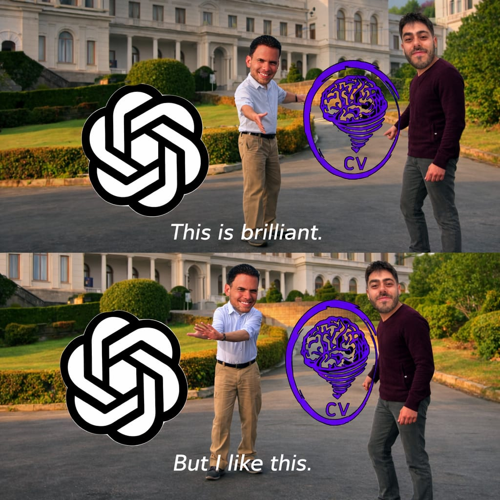

# PTDR OCR Research Workspace

> Personal disclaimer: this repository is my effort to solve end-to-end OCR on the PTDR dataset introduced in [zobeirraisi/PTDR](https://github.com/zobeirraisi/PTDR). An important disclaimer is that I did not write a single line of code in this repo myself; it was produced entirely through vibe coding, following my instructions. I managed to get some fair results, with "more than the trivial thing to do" kinds of solutions, but there is still a lot left to do.

<p align="center">
  
</p>

This repository is a research workspace built around the PTDR benchmark for Persian scene-text OCR. It combines:

- MMOCR-based text detection training (`DBNet`, `DBNet++`)
- PARSeq-based text recognition training
- mixed-dataset manifest builders for train-only external data
- robustness experiments for rotation and hard capture conditions
- end-to-end evaluation utilities that run detector + recognizer together

This is not just a dataset mirror. It is the operational code used to train, evaluate, and iterate on PTDR-focused OCR experiments.

## What Is Here

- `experiments/ptdr/`: the main training, manifest-building, evaluation, and notebook code
- `scripts/`: local and remote automation helpers for common experiment flows
- `util/`: small dataset-conversion utilities from the original PTDR workflow
- `deep-research-report.md`: literature/context notes used during the project

The GitHub-ready version of this repo intentionally excludes downloaded datasets, generated manifests, checkpoints, and local experiment outputs. Those live under `dataset/`, `experiments/ptdr/manifests/`, and `work_dirs/` on a working machine, but they should not be versioned.

## Main Capabilities

- Build PTDR detection manifests for MMOCR on every run
- Build PTDR recognition LMDB datasets for PARSeq on every run
- Mix PTDR with external train-only datasets while keeping PTDR-only validation/test
- Run clean, hard-augmented, staged, and curriculum training schedules
- Evaluate detector and recognizer jointly with visualization outputs
- Explore augmentations and training samples in notebooks before changing configs

## Expected Data Layout

The trainers expect a local checkout that looks roughly like this:

```text
PTDR/
├── dataset/
│   ├── detection/          # official PTDR detection images + labels
│   ├── recognition/        # official PTDR recognition crops + labels
│   ├── synth/              # PTDR-Synth lives here after download
│   ├── external/           # optional train-only external datasets
│   └── fatdr/              # optional notes / local FATDR assets
├── experiments/ptdr/
├── scripts/
├── util/
└── work_dirs/             # created by training and evaluation
```

## Environment Setup

This repo targets Python 3.10 on Linux with NVIDIA GPUs.

```bash
conda create -n ptdr python=3.10 -y
source "$(conda info --base)/etc/profile.d/conda.sh"
conda activate ptdr
python -m pip install --upgrade pip setuptools wheel
pip install -r requirements.txt
```

If `mmcv` does not install cleanly from pip, install it with `openmim`:

```bash
mim install "mmcv<2.2.0"
```

The requirements are pinned around the PyTorch 2.0 / CUDA 11.8 OpenMMLab stack used by the training code.

## Getting The Data

### 1. PTDR real data

Place the official PTDR detection and recognition folders under:

- `dataset/detection`
- `dataset/recognition`

The original dataset release is described in the PTDR paper and upstream project:

- paper: https://link.springer.com/article/10.1007/s42979-025-04196-7
- upstream repo: https://github.com/zobeirraisi/PTDR

### 2. PTDR-Synth recognition pretraining data

```bash
bash scripts/download_ptdr_synth.sh
```

This downloads the upstream `PTDR-SYNTH.zip` archive into `dataset/synth/` and exposes it at `dataset/synth/ptdr_synth`.

### 3. Optional external train-only datasets

```bash
source "$(conda info --base)/etc/profile.d/conda.sh"
conda activate ptdr
bash scripts/download_external_datasets.sh
```

The downloader supports:

- `EvArEST`
- `Total-Text`
- `CTW1500`
- `TextOCR`
- `IR-LPR`

`ICDAR2019 MLT` is expected separately under `dataset/external/icdar2019_mlt`.

## Validate The Local Dataset

Before training, check for malformed annotations:

```bash
python experiments/ptdr/validate_dataset.py \
  --include-domain indoor_text \
  --include-domain outdoor_text
```

## Core Workflows

All main trainers rebuild their manifests automatically and accept `pyrallis` CLI overrides, so nested config values can be changed from the command line.

### Train DBNet++

Baseline PTDR-only DBNet++:

```bash
python experiments/ptdr/train_dbnetpp.py \
  --config_path experiments/ptdr/configs/dbnetpp.yaml
```

Example override:

```bash
python experiments/ptdr/train_dbnetpp.py \
  --config_path experiments/ptdr/configs/dbnetpp.yaml \
  --training.max_epochs 50 \
  --wandb.run_name dbnetpp-scene-50ep
```

Useful detection configs:

- `experiments/ptdr/configs/dbnetpp.yaml`
- `experiments/ptdr/configs/dbnet_multidata_all.yaml`
- `experiments/ptdr/configs/dbnet_multidata_all_r18.yaml`
- `experiments/ptdr/configs/dbnet_multidata_all_r18_hard_faststable.yaml`
- `experiments/ptdr/configs/dbnetpp_multidata_clean_stage.yaml`
- `experiments/ptdr/configs/dbnetpp_multidata_hard_finetune_stage.yaml`

Two-stage DBNet++ run:

```bash
bash scripts/run_dbnetpp_two_stage.sh
```

### Train PARSeq

Baseline PTDR recognition training:

```bash
python experiments/ptdr/train_parseq.py \
  --config_path experiments/ptdr/configs/parseq.yaml
```

Example override:

```bash
python experiments/ptdr/train_parseq.py \
  --config_path experiments/ptdr/configs/parseq.yaml \
  --training.batch_size 64 \
  --training.max_epochs 30 \
  --wandb.run_name parseq-scene-bs64
```

Useful recognition configs:

- `experiments/ptdr/configs/parseq.yaml`
- `experiments/ptdr/configs/parseq_multidata_all.yaml`
- `experiments/ptdr/configs/parseq_multidata_all_norm_v2.yaml`
- `experiments/ptdr/configs/parseq_multidata_all_norm_v2_hard.yaml`
- `experiments/ptdr/configs/parseq_ptdr_synth_pretrain.yaml`
- `experiments/ptdr/configs/parseq_multidata_all_norm_v2_hard_from_ptdr_synth.yaml`

Two-stage PTDR-Synth then mixed-data PARSeq:

```bash
bash scripts/run_parseq_two_stage.sh
```

Three-phase curriculum run:

```bash
bash scripts/run_parseq_curriculum.sh
```

The recognizer uses a canonicalized Arabic/Persian target charset so equivalent Unicode forms do not become duplicate classes. Details are documented in [`experiments/ptdr/RECOGNIZER_CHARSET.md`](experiments/ptdr/RECOGNIZER_CHARSET.md).

### Rotation And Hard-Condition Experiments

Per-crop 4-way rotation classifier:

```bash
python experiments/ptdr/train_crop_rotation_classifier.py \
  --config_path experiments/ptdr/configs/crop_rotation_classifier.yaml
```

Affine spatial transformer before detection:

```bash
python experiments/ptdr/train_affine_stn.py \
  --config_path experiments/ptdr/configs/affine_stn.yaml
```

These experiments live alongside the main DBNet/PARSeq pipeline and target detector-recognizer handoff failures under rotation, jitter, and difficult capture conditions.

### End-to-End Evaluation

Run DBNet detection and PARSeq recognition together:

```bash
python experiments/ptdr/evaluate_end_to_end.py \
  --dbnet-checkpoint work_dirs/dbnet_r50_ptdr_scene/epoch_1.pth \
  --parseq-checkpoint work_dirs/parseq_ptdr_scene/checkpoints/last.ckpt \
  --split test
```

Outputs are written under `work_dirs/end_to_end_eval/.../` and include:

- `summary.json`
- `per_image.jsonl`
- overlay visualizations
- crop visualizations for the first evaluated samples

## Notebooks And Inspection Tools

Useful notebooks and preview helpers:

- `experiments/ptdr/notebooks/end_to_end_inference.ipynb`
- `experiments/ptdr/notebooks/dbnet_training_preview.ipynb`
- `experiments/ptdr/notebooks/ptdr_augmentation_preview.ipynb`

The generator scripts for the preview notebooks live next to them and can be rerun if you want to refresh notebook contents after code changes.

## Remote Execution Helpers

For multi-machine iteration, the `scripts/` folder includes helpers to:

- bootstrap a remote runner
- sync only code/config changes
- launch DBNet or PARSeq inside tmux on a remote host
- resume longer curriculum jobs more safely

Examples:

```bash
scripts/bootstrap_remote.sh visionspot5
scripts/sync_code_to_host.sh visionspot5
scripts/run_dbnetpp_remote.sh visionspot5 dbnetpp-baseline
scripts/run_parseq_remote.sh visionspot5 parseq-baseline
```

`scripts/bootstrap_remote.sh` clones `remote.origin.url` by default when the local checkout is already connected to a git remote, so it can follow your own GitHub fork once you publish this repo.

## Additional Reading

More experiment-specific detail is documented in:

- [`experiments/ptdr/README.md`](experiments/ptdr/README.md)
- [`experiments/ptdr/RECOGNIZER_CHARSET.md`](experiments/ptdr/RECOGNIZER_CHARSET.md)
- [`deep-research-report.md`](deep-research-report.md)

## Citation

If you use the PTDR dataset itself, cite the upstream paper:

```bibtex
@article{raisi2025ptdr,
  title={PTDR: A Real-World and Synthetic Benchmark Dataset for Persian Scene and Document Text Detection and Recognition},
  author={Raisi, Zobeir and Nazarzehi Had, Valimohammad and Sarani, Esmaeil and Damani, Raosul},
  journal={SN Computer Science},
  volume={6},
  number={6},
  pages={1--16},
  year={2025},
  publisher={Springer}
}
```
